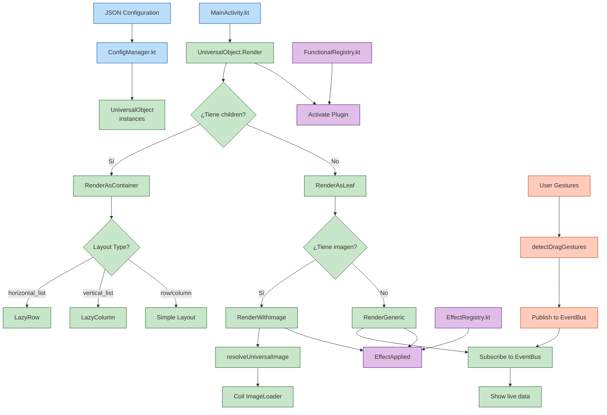

# Core Architecture Specification

## 1. The UniversalObject: Formal Definition

The `UniversalObject` is the foundational, recursive unit of the entire system. It is a data-centric entity, completely defined by external JSON configuration and agnostic to any specific domain.

### 1.1 Properties

- **`id`** (String, mandatory): A unique identifier for the object within its tree.
- **`type`** (String, mandatory): A logical key that maps to a plugin responsible for the object's behavior and rendering (e.g., `card`, `sensor_source`, `visual_display`, `container`).
- **`epigenome`** (Map, optional): The **persistent, observable state** of the object (e.g., `"idle"`, `"flipped"`, `"processing"`). This state is serialized and restored to maintain UI continuity across sessions. It represents the object's "lived experience."
- **`state`** (Map, optional): The **internal, mutable state** managed at runtime. It can be volatile and is used for transient logic, calculations, or temporary values not required for persistence.
- **`visual`** (Map, optional): Visual properties such as color, image references, layout constraints, and size.
- **`behavior`** (Map, optional): Declarative mapping of user gestures (tap, swipe, drag) to effects or state transitions.
- **`children`** (List of UniversalObject, optional): An ordered list of child `UniversalObject` instances, enabling the composition of complex hierarchies from this single primitive.

### 1.2 Key Axioms

- **Axiom of Universality**: Any element in any interactive domain can be modeled as a `UniversalObject`.

- **Axiom of Recursion**: A `UniversalObject` can contain other `UniversalObject`s, enabling infinite compositional depth.
- **Axiom of Declarativeness**: The structure and initial configuration of an object tree are defined purely in a declarative manifest.

## 2. Runtime Components

The engine runtime is composed of three singleton managers that operate on the `UniversalObject` tree:

| Component | Responsibility |
| :--- | :--- |
| **`UniversalScreen`** | The root orchestrator. Loads the declarative manifest (JSON), parses it into a tree of `UniversalObject` instances, and manages the overall render cycle. |
| **`UniversalViewModel`** | The single source of truth. Maintains the global application state, registers all objects, manages the `epigenome`, and handles navigation and focus logic, ensuring data-view synchronization. |
| **`UniversalFocusView`** | The performance and attention core. Renders the list of `UniversalObject`s by applying visual and focus transformations **strictly as dictated by the object's data**, without imposing hard-coded domain rules. |

## 3. The Declarative Data Flow

The application lifecycle is a direct interpretation of data:

1. **Manifest Load**: A JSON file (e.g., `tarot-deck.json`) is loaded from the asset bundle.
2. **Parsing & Instantiation**: The JSON is deserialized into a tree of `UniversalObject` data structures.
3. **Registration**: The tree is passed to the `UniversalViewModel`, which registers each object and establishes reactive state bindings.
4. **Rendering**: The `UniversalScreen` and `UniversalFocusView` traverse the registered tree. Each object's `type` resolves to a specific plugin that handles its rendering and interaction logic, using properties from `visual`, `epigenome`, and `state`.
5. **Interaction Loop**: User gestures are mapped via the `behavior` property to effects (defined in a shared animation suite) or direct `epigenome`/`state` updates, which propagate reactively through the `UniversalViewModel`.

## 4. Multi-Domain Demonstration

The power of this architecture is proven through configuration alone. Below are summaries of the three provided examples. The engine code is identical for all.

### 4.1. Tarot System (`examples/tarot-universal.json`)

Models a deck of Major Arcana cards. Each `card`-type object has an `epigenome` containing immutable symbolic metadata (arcana, element, frequency) and a `state` for mutable properties like `face_up` and `position`. A `flip` gesture in the `behavior` block triggers a visual effect.

### 4.2. Sensor Dashboard (`examples/sensor-dashboard-universal.json`)

Models a real-time physics monitor. A `sensor_source`-type object has an `epigenome` defining its sensor type (`ACCELEROMETER`) and unit. Its `state` is continuously updated with live readings. A separate `visual_display`-type object listens to this data channel and renders it.

### 4.3. Quantum Generator Lab (`examples/quantum-lab-universal.json`)

Models a complex generative system. It combines a `sensor_source` (for physical entropy), a `service_source` (fetching moon phase from an astronomy API), and an `algorithm_processor` (which harmonizes the data streams using the golden ratio). The final output is rendered by a `card`-type object, demonstrating how primitive types can be composed to create emergent, domain-specific behavior.

## 5. Conclusion

This architecture demonstrates that a unified, declarative model for interactive applications is both feasible and powerful. By reducing any application to a tree of configured `UniversalObject` instances, it achieves a level of abstraction where the engine is truly universal, and complexity is managed entirely through structured data.

## Esquema de Flujo del Motor Universal (Ilustrativo)

