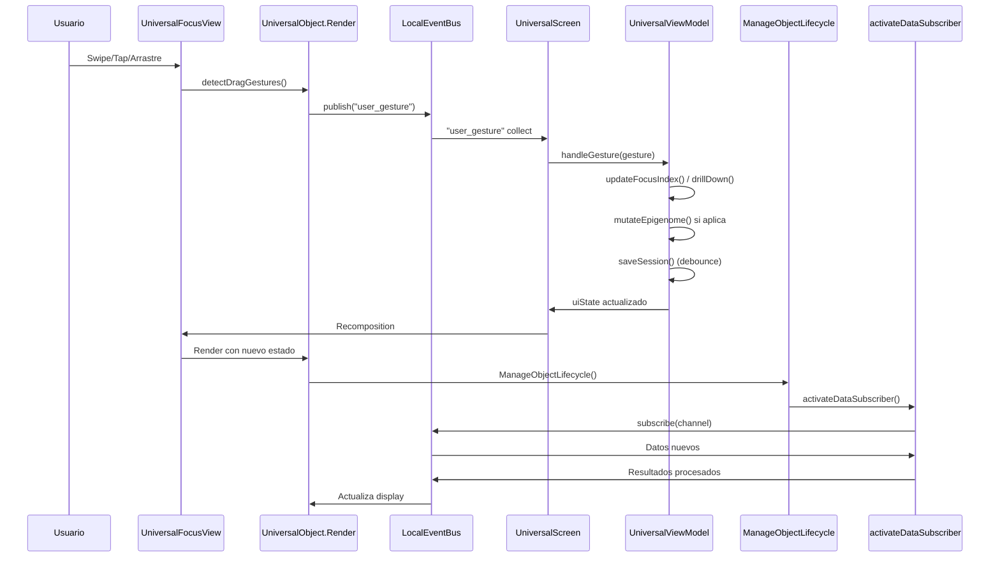

# Universal Declarative Engine

> One recursive object model for any interactive domain.

## The Problem

Building a new app means choosing yet another framework: React, SwiftUI, Jetpack Compose, Unity. Each is a silo with its own rules, creating endless reinvention and complexity.

## The Vision: One Atomic Pattern

What if every interactive element—a tarot card, a sensor gauge, a puzzle tile—was the same kind of object? What if your entire application was just a configuration file?

This project proposes a **Universal Declarative Engine**, where a single, recursive `UniversalObject` model can render any domain through purely declarative manifests (JSON).

## Core Architecture: Four Singletons

The engine is built on four irreducible components that manage the `UniversalObject` tree:

1. **`UniversalObject`**: The recursive atom. Everything is an instance of it, defined by a `type`, a persistent `epigenome`, and a mutable `state`.
2. **`UniversalScreen`**: The one canvas. It loads and orchestrates the rendering of the object tree from JSON data.
3. **`UniversalViewModel`**: The single source of truth. Manages global UI state, object registry, and navigation focus.
4. **`UniversalFocusView`**: The attention engine. Renders objects by applying visual and focus transformations dictated purely by data.

## The Declarative Principle

You don't write engine code. You declare your app in a JSON manifest. The engine's only role is to interpret this data, instantiate the object tree, and manage its lifecycle.

**To add a feature, you edit the manifest—not the engine.**

## Multi-Domain Proof

The same engine runs radically different applications. Explore the examples:

* **[Tarot System](./examples/tarot-universal.json)**: Cards with rich semantic metadata and flip animations.
* **[Sensor Dashboard](./examples/sensor-dashboard-universal.json)**: Real-time physics monitoring with live data binding.
* **[Quantum Generator Lab](./examples/quantum-lab-universal.json)**: Blends device entropy with astronomical data to produce emergent output.

Only the manifests and the plugins they reference differ. The core engine is unchanged.

## This Repository

This repo contains the **public specification, interfaces, and proof-of-concept** for the Universal Declarative Engine. It is a formalization of the architecture presented in our accompanying whitepaper.

* Explore the formal **[Core Architecture](./ARCHITECTURE.md)**.
* Examine the **[Kotlin interfaces](./src/interfaces/)** defining the public API.
* Study the **[multi-domain examples](./examples/)**.

## Getting Involved

This is not just another framework. It's an attempt to find a fundamental pattern for interactive software. If the vision of a unified, declarative engine resonates with you—whether you're a frontend developer, robotics engineer, game designer, or philosopher of code—your perspective is valuable.

**Let's build the one engine to rule them all. Not by domination, but by unification.**

## Ciclo de Interacción Data-Driven (Secuencia Ilustrativa)

## License

This project is licensed under the **GNU General Public License v3.0**.
